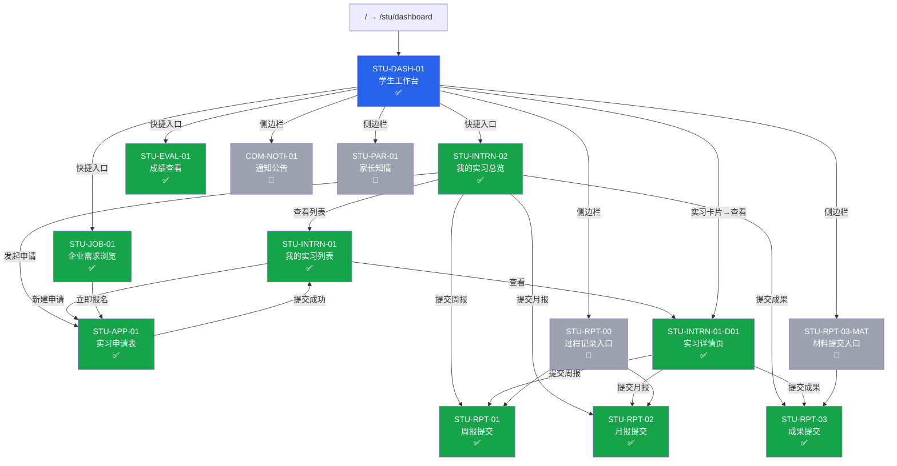
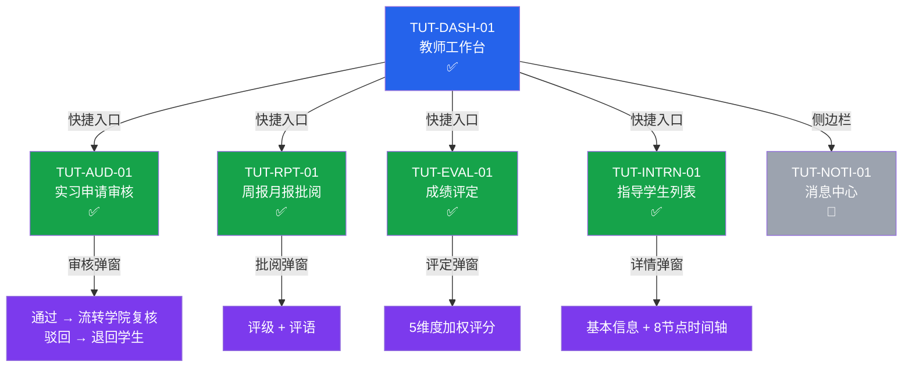

# 实习管理系统 — 页面地图

> 最后更新：2026-06-23 · 分支 `feature/core-internship-flow` · 已实现 17 页

---

## 学生端（14 页）



---

## 教师端（5 页 + 1 占位）



---

## 完整页面清单

```
/ (重定向)
├── /stu/dashboard                  STU-DASH-01  学生工作台          ✅
├── /stu/internships/overview       STU-INTRN-02 我的实习总览        ✅
├── /stu/internships                STU-INTRN-01 我的实习列表        ✅
│   └── /stu/internships/:id        STU-INTRN-01-D01 实习详情页     ✅
├── /stu/internships/new            STU-APP-01   实习申请表          ✅
├── /stu/jobs                       STU-JOB-01   企业需求浏览        ✅
├── /stu/evaluations                STU-EVAL-01  成绩查看            ✅
├── /stu/reports                    STU-RPT-00   过程记录入口        🔲
│   ├── /stu/reports/weekly/new     STU-RPT-01   周报提交            ✅
│   └── /stu/reports/monthly/new    STU-RPT-02   月报提交            ✅
├── /stu/materials                  STU-RPT-03-MAT 材料提交入口      🔲
│   └── /stu/achievements/new       STU-RPT-03   成果提交            ✅
├── /stu/messages                   COM-NOTI-01  通知公告            🔲
├── /stu/parent-notice              STU-PAR-01   家长知情            🔲
│
├── /teacher/dashboard              TUT-DASH-01  教师工作台          ✅
├── /teacher/applications           TUT-AUD-01   实习申请审核        ✅
├── /teacher/reports                TUT-RPT-01   周报月报批阅        ✅
├── /teacher/grades                 TUT-EVAL-01  成绩评定            ✅
├── /teacher/students               TUT-INTRN-01 指导学生列表        ✅
├── /teacher/notifications          TUT-NOTI-01  消息中心            🔲
│
└── /*                              404 兜底                         ✅
```

---

## 统计

| 角色 | ✅ 已完成 | 🔲 占位 | 合计 |
|------|----------|--------|------|
| 学生端 | 10 | 4 | 14 |
| 教师端 | 5 | 1 | 6 |
| 系统 | 2 | 0 | 2 |
| **合计** | **17** | **5** | **22** |

---

## 图例

| 颜色 | 含义 |
|------|------|
| 🔵 蓝 | 工作台入口页 |
| 🟢 绿 | 已完成功能页 |
| 🟣 紫 | 弹窗/模态框 |
| ⚪ 灰 | 占位/待实现 |
