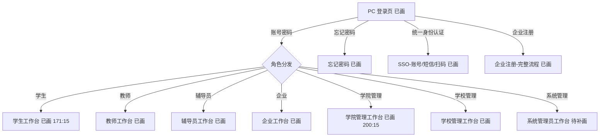
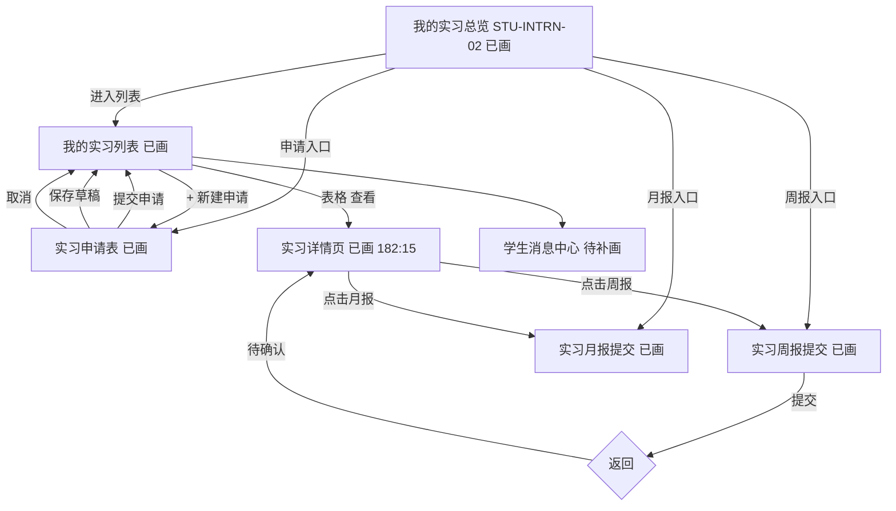
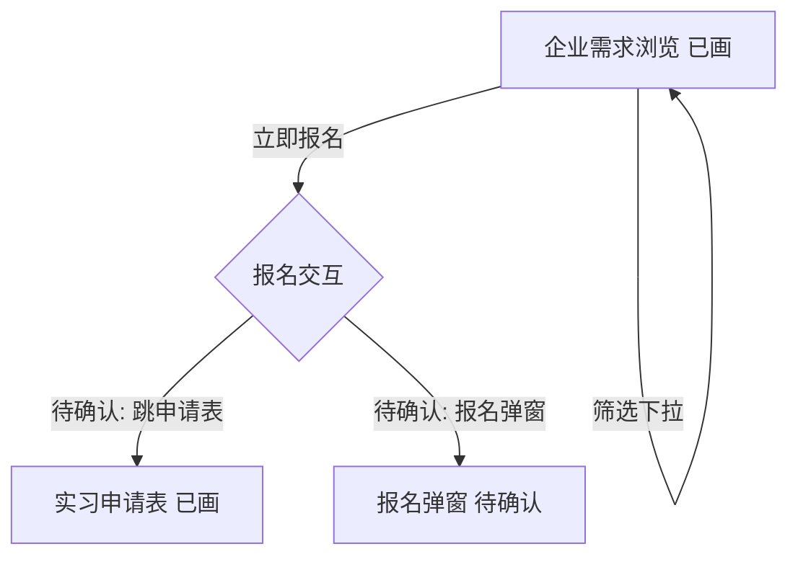
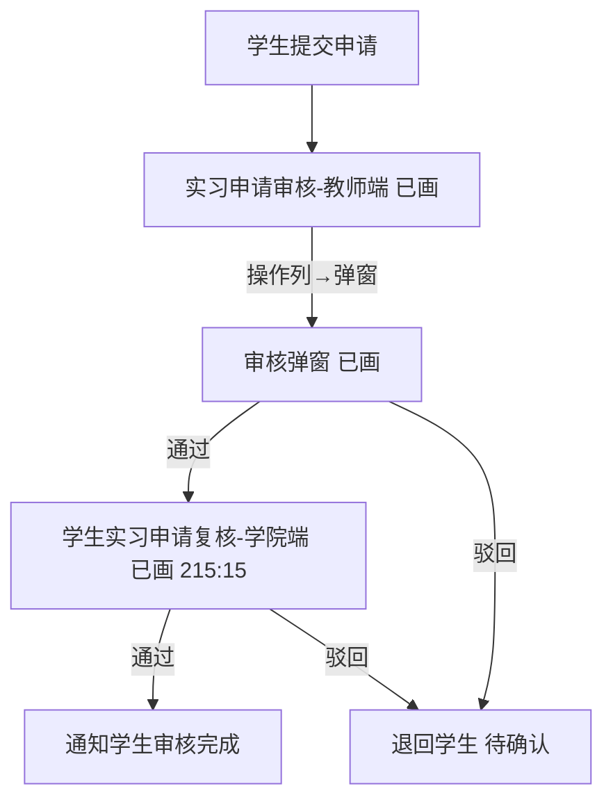
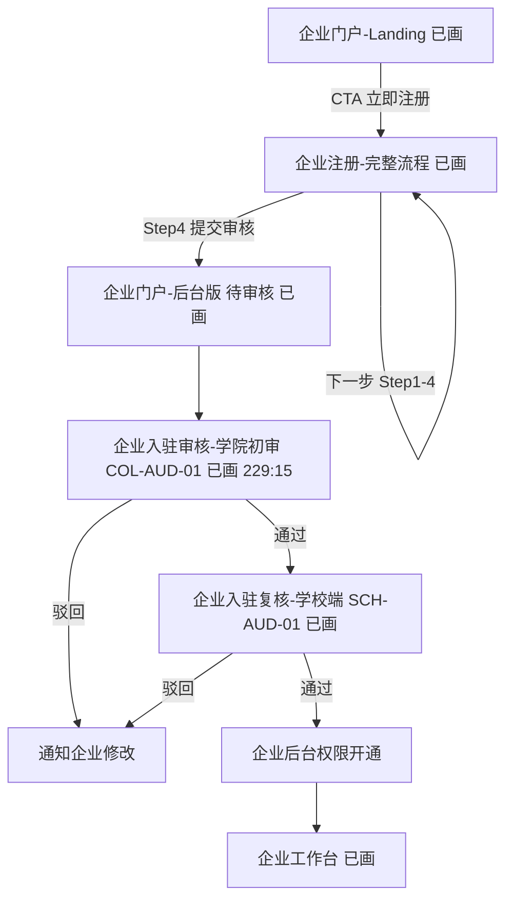
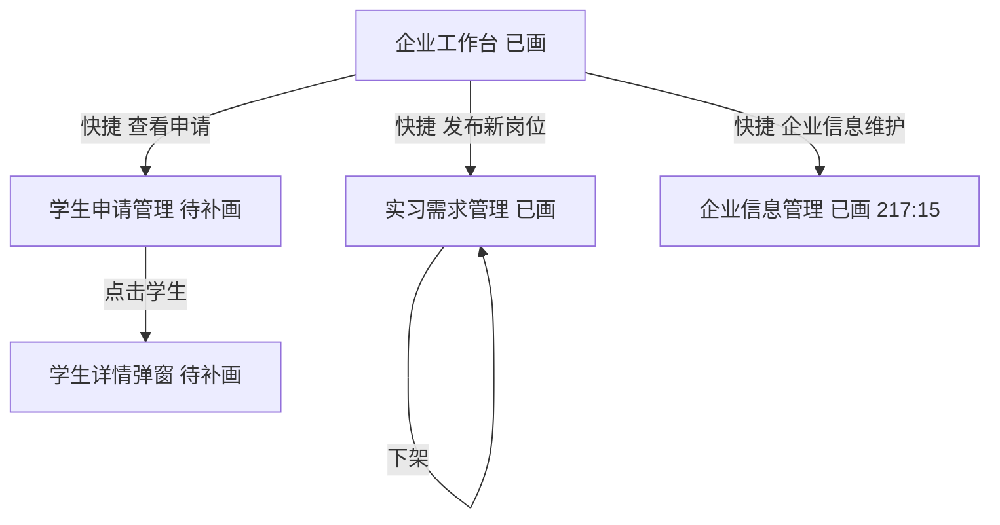
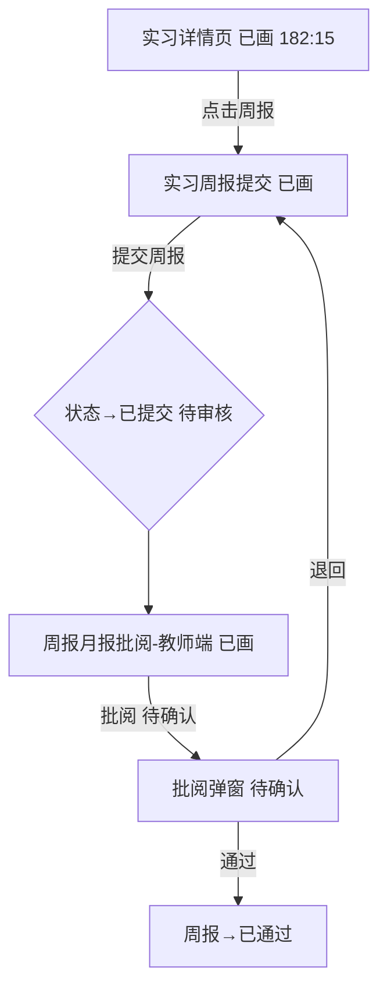
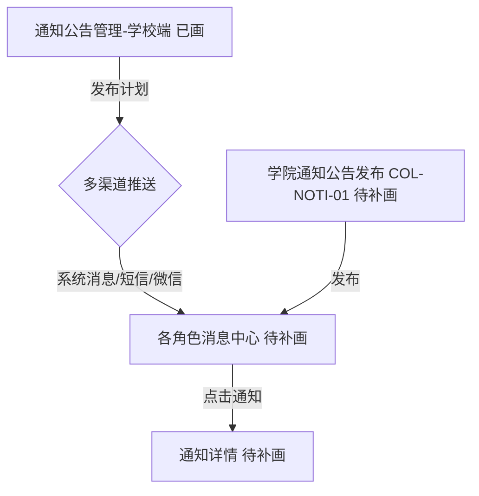

# 实习管理系统页面跳转关系与路由规划

> 最后更新: 2026-06-30
> Figma 文件: `vyOniy0QCWKZ5XunXuyzMk`
> 配套精简版：`页面跳转关系与路由规划-精简版.md`（已同步全部 34 页核实结论，为当前主用文档；本文为完整底稿）

## 0. 第二轮路由执行基线

第一轮 A/B 两线已有页面产出已经完成并形成当前路由基线，但《项目分工》中的第二轮任务尚未开始。第二轮不再按照“建议路由”重复新建页面，而是以 `src/router/*.js` 中已注册路由为基线逐项联调验收。本文后续的 Figma 探查和建议路由保留为历史设计依据；若与本节冲突，以本节和代码为准。

### 0.1 当前角色路由前缀

| 角色端 | 当前前缀 | 路由模块 | 第二轮负责人 |
|---|---|---|---|
| 公共认证 | `/login`、`/sso/*`、`/m/*`、`/pad/*` | `src/router/auth.js` | B 线（同学） |
| 学生端 | `/stu/*` | `src/router/stu.js` | A 线（我） |
| 教师端 | `/teacher/*` | `src/router/tut.js` | A 线（我） |
| 学院端 | `/college/*` | `src/router/col.js` | 学生申请复核 A；企业初审 B |
| 学校端 | `/school/*` | `src/router/sch.js` | 企业复核 B；其他页面 A |
| 企业端 | `/company/*`、`/portal*` | `src/router/ent.js` | B 线（同学） |
| 辅导员端 | `/counselor/*` | `src/router/cou.js` | B 线（同学） |
| 系统管理端 | `/admin/*` | `src/router/sys.js` | B 线（同学，P2 仅入口验收） |
| 公共通知 | `/notifications`、`/notifications/:id` | `src/router/index.js` | A 维护模板，B 配合入口确认 |

### 0.2 第二轮主链路

* 学生申请：`/stu/jobs` → `/stu/internships/new` → `/stu/internships` → `/stu/internships/:internshipId`
* 教师初审：`/teacher/dashboard` → `/teacher/applications`
* 学院学生复核：`/college/applications/review`
* 企业入驻：`/company/register` → `/college/companies/review` → `/school/companies/review` → `/company/dashboard`
* 企业岗位：`/company/jobs` → `/company/jobs/new`
* 企业评价：`/company/internships` → `/company/internships/:id/evaluation`
* 辅导员：`/counselor/dashboard` → `/counselor/students` 或 `/counselor/alerts`

### 0.3 Figma 对应结论

既有 Figma MCP 核验记录确认核心业务页面 Node ID 有效。以下页面不要求独立 Figma Frame：

* 学生家长知情已画 `339:15`；过程记录入口已画 `346:15`；材料提交入口已画 `347:15`。
* 各角色消息中心主要复用 `COM-NOTI-01`；辅导员消息中心无独立 Frame。
* 系统管理端 P2 页面 Figma 暂缓，第二轮只验收现有入口。

> 旧文档曾使用 `/student/*` 作为建议路由；当前实现已统一为 `/stu/*`，第二轮禁止按旧建议新增重复路由。

### 0.4 A 线第一批精确 Frame ID（2026-06-30 实时核验）

| 页面编号 | 外层 Node ID | 实际 Desktop Frame ID |
|---|---|---|
| `STU-JOB-01` | `72:41` | `164:2934` |
| `STU-APP-01` | `8:59` | `164:3408` |
| `STU-INTRN-01` | `32:59` | `164:3281` |
| `STU-INTRN-01-D01` | `182:15` | `182:16` |
| `TUT-DASH-01` | `26:59` | `164:3879` |
| `TUT-AUD-01` | `85:15` | `164:2542` |
| `COL-AUD-02` | `215:15` | `215:16` |

---

## 1. 分析范围与说明

### 1.1 已读取的依据文档

- `实习管理系统页面资产台账.md`（2026-06-10，页面编号 / 状态 / 交互与跳转 / 业务规则 / 待确认问题）
- `页面分类与缺失分析.md`（2026-06-10，34 页清单 + 管理端侧边栏对照 + 缺失页面）
- `进度表.md`、`实习管理系统需求分析.md`、`agent.md`（背景信息）

### 1.2 已通过 Figma MCP 核实的页面

初次整理时直接读取了 15 个关键 Figma 页面。后续补充逐页核实，当前已完成 34/34 页面覆盖（7 个认证页 + 27 个业务页），对应 Node ID 均有效。下表保留初次重点核实页面，仅作为过程记录。

| 角色 | 已直接核实页面 | Node ID |
|------|---------------|---------|
| 公共 | PC 登录页 | `26:439` |
| 学生 | 实习申请表 | `8:59` |
| 学生 | 我的实习列表 | `32:59` |
| 学生 | 实习周报提交 | `54:59` |
| 学生 | 企业需求浏览 | `72:41` |
| 教师 | 教师工作台 | `26:59` |
| 教师 | 实习申请审核 | `85:15` |
| 学校管理 | 学校管理工作台（管理员界面） | `26:176` |
| 学校管理 | 企业入驻复核（SCH-AUD-01，原 B11） | `109:15` |
| 学校管理 | 通知公告管理 | `114:15` |
| 企业 | 企业工作台 | `128:15` |
| 企业 | 实习需求管理 | `130:15` |
| 企业 | 企业门户-Landing | `132:15` |
| 企业 | 企业注册-完整流程 | `139:15` |
| 辅导员 | 辅导员工作台 | `120:15` |

> ⚠️ **重要说明 1**：未带 `nodeId` 调用 `get_metadata` 时，Figma MCP 只返回当前/首个页面（`8:59`），**不会一次性枚举全部页面**。本轮通过资产台账中记录的 Node ID 逐个直查确认，34 个页面对应的 Node ID 在 Figma 中**确实存在**（探查未报错）。
>
> ⚠️ **重要说明 2**：多数页面将侧边栏作为组件实例（`左侧导航栏` / 组件 `1:13`）使用，菜单文字封装在组件内部，页面级 `get_metadata` 不会展开组件内的菜单文字。因此**学生 / 教师 / 企业 / 辅导员端的侧边栏菜单具体文字标签本轮未能从页面结构中直接读出**，相关导航菜单条目依据「该角色已存在的页面集合」+ 资产台账推断，菜单的**确切文字标签**标记为待确认。学校管理端侧边栏文字在 `26:176` 中**直接可见**，可信度高。
>
> ⚠️ **重要说明 3**：`8:59 实习申请表` 内嵌的侧边栏文字为「工作台/实习管理/毕业实习/灵活实习/认知实习/社会实践/企业管理/通知公告/统计分析/系统管理」，疑似早期占位用通用侧边栏（含企业管理、系统管理等非学生菜单），**不能作为学生端真实导航依据**。

### 1.3 本文档边界

- ✅ 仅关注页面之间的**跳转关系与路由**
- ✅ 区分：导航跳转 / 页面跳转 / 弹窗 Modal / 抽屉 Drawer / 卡片展开 / Tab 切换 / 状态变化 / 返回
- ❌ 不统计页面总数
- ❌ 不整理设计资产（颜色 / 字体 / 组件 ID）
- ❌ 不生成前端代码（第 7 节仅给出路由建议）
- ❌ 不修改 Figma 原型（本轮为只读分析）
- 🔖 无法确认的交互统一标记 **「待确认」**
- 🆕 md 文档中提到但 Figma 中尚无对应 Frame 的页面统一标记 **「待补画」**

---

## 2. 页面跳转关系总览

> 字段：所属角色 / 起始页面 / 触发入口 / 目标页面或结果 / 页面是否存在 / 返回页面 / 备注
> 页面是否存在：**已画**（Figma 中存在 Frame）/ **待补画**（md 提及但 Figma 无 Frame）/ **待确认**（无法判断）

### 2.1 登录认证与角色分发

| 所属角色 | 起始页面 | 触发入口 | 目标页面或结果 | 页面是否存在 | 返回页面 | 备注 |
| ---- | ---- | ---- | ------- | ------ | ---- | -- |
| 公共 | 企业门户-Landing | 顶栏「登录」按钮 | PC 登录页 | 已画 | — | `132:15` → `26:439` |
| 公共 | 企业门户-Landing | Hero「CTA 立即注册」按钮 | 企业注册-完整流程 | 已画 | — | `132:15` CTA → `139:15` |
| 公共 | 企业门户-Landing | 页脚「企业注册」 | 企业注册-完整流程 | 已画 | — | — |
| 公共 | 企业门户-Landing | 页脚「发布需求」 | 实习需求管理 | 已画 | — | 需先登录，未登录应跳登录页；待确认 |
| 公共 | 企业门户-Landing | 顶栏「首页/合作企业/实习项目/关于我们」 | 对应 Landing 区块 | 已画 | — | 页内锚点滚动，非独立页面 |
| 公共 | PC 登录页 | 登录成功（学生） | 学生工作台 | 已画 | — | 角色分发 → `171:15`（STU-DASH-01 已补画 2026-06-15） |
| 公共 | PC 登录页 | 登录成功（教师） | 教师工作台 | 已画 | — | 角色分发 → `26:59` |
| 公共 | PC 登录页 | 登录成功（辅导员） | 辅导员工作台 | 已画 | — | 角色分发 → `120:15` |
| 公共 | PC 登录页 | 登录成功（企业） | 企业工作台 | 已画 | — | 角色分发 → `128:15`；待确认是否经门户后台 |
| 公共 | PC 登录页 | 登录成功（学校管理） | 学校管理工作台 | 已画 | — | 角色分发 → `26:176` |
| 公共 | PC 登录页 | 登录成功（学院管理） | 学院管理工作台 | 已画 | — | 角色分发 → COL-DASH-01 `200:15`（2026-06-15） |
| 公共 | PC 登录页 | 登录成功（系统管理） | 系统管理员工作台 | 待补画 | — | SYS-DASH-01 待补画（P2） |
| 公共 | PC 登录页 | 「忘记密码」 | 忘记密码 | 已画 | 返回登录页 | `COM-AUTH-02` `26:526` |
| 公共 | PC 登录页 | 「统一身份认证（SSO）」 | 统一身份认证-账号 | 已画 | 返回登录页 | `COM-AUTH-03` `26:527`，SSO 链路 |
| 公共 | 统一身份认证-账号 | 切换短信/扫码 | 统一身份认证-短信 / 扫码 | 已画 | 返回登录页 | `26:528` / `26:529`，SSO 内 Tab/页间切换 |
| 公共 | PC 登录页 | 「企业注册」入口 | 企业注册-完整流程 | 已画 | 返回登录页 | `COM-AUTH-08` → `139:15` |
| 企业 | 企业注册-完整流程 | 「已有账号」 | PC 登录页 | 已画 | — | `139:15` 顶栏 → `26:439` |
| 企业 | 企业注册-完整流程 | 步骤「下一步」 | 同页步骤 2→3→4 | 已画 | — | 当前为单页四步；资产台账建议拆 ENT-ONB-01~04 |
| 企业 | 企业注册-完整流程 | Step4 提交审核 | 企业门户-后台版（待审核） | 已画 | — | 提交后跳转后台 `135:15`；待确认是否经「提交成功」中间态 |

### 2.2 学生端

| 所属角色 | 起始页面 | 触发入口 | 目标页面或结果 | 页面是否存在 | 返回页面 | 备注 |
| ---- | ---- | ---- | ------- | ------ | ---- | -- |
| 学生 | 我的实习列表 | 「+ 新建申请」按钮 | 实习申请表 | 已画 | 提交后返回列表 | `32:59` → `8:59` |
| 学生 | 我的实习列表 | 表格「查看」操作 | 实习详情页 | 已画 | 返回列表 | 操作列「查看」；STU-INTRN-01-D01 已画 `182:15`（2026-06-15） |
| 学生 | 我的实习列表 | 顶部通知 / 「查看通知」 | 学生消息中心 | 待补画 | 返回列表 | 复用 COM-NOTI-01 模板 |
| 学生 | 我的实习总览 | 周报入口 | 实习周报提交 | 已画 | 返回总览 | STU-INTRN-02(`164:4225`) → STU-RPT-01 |
| 学生 | 我的实习总览 | 月报入口 | 实习月报提交 | 已画 | 返回总览 | → STU-RPT-02 |
| 学生 | 我的实习总览 | 实习申请入口 | 实习申请表 | 已画 | 返回总览 | → STU-APP-01 |
| 学生 | 我的实习总览 | 详情/列表入口 | 实习详情页 / 我的实习列表 | 待补画 / 已画 | 返回总览 | → STU-INTRN-01-D01 / STU-INTRN-01 |
| 学生 | 我的实习总览 | 材料提醒「去提交」 | 实习成果提交 / 材料上传 | 待确认 | 返回总览 | 跳 STU-RPT-03 或材料上传交互，待确认 |
| 学生 | 学生工作台 / 侧栏「我的实习」 | 进入「我的实习」 | 我的实习总览 | 已画 | 返回来源 | STU-INTRN-02 作为"我的实习"落地总览；与列表 STU-INTRN-01 的关系待确认 |
| 学生 | 实习申请表 | 「提交申请」 | 我的实习列表 | 已画 | — | 状态→审核中；返回行为待确认 |
| 学生 | 实习申请表 | 「取消」 | 我的实习列表 | 已画 | — | 丢弃当前输入 |
| 学生 | 实习申请表 | 「保存草稿」 | 列表（可继续编辑） | 已画 | 返回列表 | 草稿态，列表内可继续编辑 |
| 学生 | 实习申请表 | 材料「去上传」 | 材料上传交互 | 待确认 | — | 弹窗 / 抽屉 / 页内，待确认交互形式 |
| 学生 | 企业需求浏览 | 卡片「立即报名」 | 实习申请表（或报名弹窗） | 待确认 | 待确认 | `72:41`；报名后是否复用 STU-APP-01 待确认 |
| 学生 | 企业需求浏览 | 筛选「实习类型/城市/学历/发布时间」 | 当前列表过滤 | 已画 | — | 页内筛选，非跳转 |
| 学生 | 实习周报提交 | 「提交周报」 | 停留 / 返回实习详情 | 已画 | 待确认 | 状态→已提交(待审核)；返回路径待确认 |
| 学生 | 实习周报提交 | 「保存草稿」 | 停留当前页 | 已画 | — | 草稿态 |
| 学生 | 实习周报提交 | 历史周报「第N周」 | 历史周报查看 | 待确认 | 返回当前页 | 是否进入只读详情待确认 |
| 学生 | 实习月报提交 | 提交 | 同周报 | 已画 | 待确认 | STU-RPT-02，结构同周报 |
| 学生 | 实习成果提交 | 提交 | 同周报 | 已画 | 待确认 | STU-RPT-03 |
| 学生 | 成绩查看 | 查看评价明细 | 评价详情 | 待确认 | 返回当前页 | STU-EVAL-01，是否有明细入口待确认 |

### 2.3 教师端（指导老师）

| 所属角色 | 起始页面 | 触发入口 | 目标页面或结果 | 页面是否存在 | 返回页面 | 备注 |
| ---- | ---- | ---- | ------- | ------ | ---- | -- |
| 教师 | 教师工作台 | 统计卡片 / 待办 | 对应管理列表 | 已画 | 返回工作台 | `26:59`；卡片→列表，目标页待确认 |
| 教师 | 教师工作台 | 快捷入口 | 实习申请审核 / 周报月报批阅 / 成绩评定 / 指导学生列表 | 已画 | 返回工作台 | 各快捷入口分别跳转 |
| 教师 | 实习申请审核 | 表格「操作」列 | 审核弹窗（Modal） | 已画 | 关闭返回列表 | `85:15`，操作列打开弹窗，非独立页 |
| 教师 | 实习申请审核 | 「批量通过」 | 批量操作确认 | 已画 | 返回列表 | 批量选中后操作 |
| 教师 | 实习申请审核 | 弹窗「通过」 | 列表（状态→已通过） | 已画 | — | 流转至学院复核 COL-AUD-02 |
| 教师 | 实习申请审核 | 弹窗「驳回」 | 列表（状态→已驳回） | 已画 | — | 退回学生 / 待确认 |
| 教师 | 周报月报批阅 | 表格「批阅」操作 | 批阅弹窗 | 待确认 | 关闭返回列表 | `98:15`；参考 TUT-AUD-01 弹窗形式，待确认 |
| 教师 | 成绩评定 | 表格「评定」操作 | 评定表单/弹窗 | 待确认 | 返回列表 | `101:15`；交互形式待确认 |
| 教师 | 指导学生列表 | 表格「查看」操作 | 学生实习详情 | 待确认 | 返回列表 | `106:15`；是否跳学生详情页待确认 |
| 教师 | 各页面 | 「消息中心」 | 指导老师消息中心 | 待补画 | — | TUT-NOTI-01，复用 COM-NOTI-01 |

### 2.4 学院管理端

| 所属角色 | 起始页面 | 触发入口 | 目标页面或结果 | 页面是否存在 | 返回页面 | 备注 |
| ---- | ---- | ---- | ------- | ------ | ---- | -- |
| 学院管理 | 学院管理工作台 | 快捷入口 | 企业入驻审核 / 学生申请复核 / 通知发布 | 已画 | 返回工作台 | COL-DASH-01 `200:15`；2×2 快捷入口（含消息中心） |
| 学院管理 | 企业入驻审核（学院初审） | 表格「操作」 | 审核弹窗（Modal） | 待确认 | 关闭返回列表 | 由 B11 `109:15` 拆分；弹窗形式参考已画 B11 |
| 学院管理 | 企业入驻审核（学院初审） | 弹窗「通过」 | 列表（流转至学校复核） | 待确认 | — | → SCH-AUD-01 |
| 学院管理 | 企业入驻审核（学院初审） | 弹窗「驳回」 | 列表（状态→已驳回） | 待确认 | — | 通知企业修改 |
| 学院管理 | 学生实习申请复核 | 表格「操作」 | 复核弹窗 | 已画 | 关闭返回列表 | COL-AUD-02 已画 `215:15`；弹窗非独立页 |
| 学院管理 | 学生实习申请复核 | 弹窗「通过」 | 列表（状态→审核完成） | 已画 | — | 通知学生 |
| 学院管理 | 学生实习申请复核 | 弹窗「驳回」 | 列表 | 已画 | — | 退回学生或指导老师，待确认 |
| 学院管理 | 学院通知公告发布 | 「发布」 | 列表刷新 | 待补画 | — | COL-NOTI-01 |
| 学院管理 | 学院消息中心 | 通知「查看」 | 通知详情 | 待补画 | 返回列表 | COL-NOTI-02，复用 COM-NOTI-01 |

### 2.5 学校管理端

| 所属角色 | 起始页面 | 触发入口 | 目标页面或结果 | 页面是否存在 | 返回页面 | 备注 |
| ---- | ---- | ---- | ------- | ------ | ---- | -- |
| 学校管理 | 学校管理工作台 | 用户管理表格「编辑」 | 编辑弹窗/抽屉 | 待确认 | 关闭返回 | `26:176`；交互形式待确认 |
| 学校管理 | 学校管理工作台 | 角色权限「查看详情」 | 权限配置页 | 待补画 | 返回工作台 | SYS-CFG-02 待补画（P2） |
| 学校管理 | 学校管理工作台 | 快捷「院系/专业/班级管理」 | 基础数据页 | 待补画 | 返回工作台 | 对应 Page 管理-基础数据 C01，待补画 |
| 学校管理 | 学校管理工作台 | 快捷「通知模板/审核流程」 | 系统配置页 | 待补画 | 返回工作台 | SYS-CFG-03，待补画（P2） |
| 学校管理 | 学校管理工作台 | 日志审计「查看全部」 | 日志审计页 | 待补画 | 返回工作台 | C03 / SYS-LOG-01，待补画（P2） |
| 学校管理 | 企业入驻复核（SCH-AUD-01） | 表格「操作」 | 审核弹窗（Modal） | 已画 | 关闭返回列表 | `109:15`（原 B11 已改名学校复核视角）；弹窗含 取消/驳回/通过 |
| 学校管理 | 企业入驻复核（SCH-AUD-01） | 弹窗「通过」 | 列表（状态→已通过） | 已画 | — | 审核最后一环：企业后台权限自动开通；前置须经 COL-AUD-01 学院初审 |
| 学校管理 | 企业入驻复核（SCH-AUD-01） | 弹窗「驳回」 | 列表（状态→已驳回） | 已画 | — | 通知企业修改（可附驳回原因） |
| 学校管理 | 企业入驻复核（SCH-AUD-01） | 弹窗「取消」 | 关闭弹窗 | 已画 | 返回列表 | 不变更状态 |
| 学校管理 | 实习计划发布 | 「发布」 | 列表刷新 | 待确认 | — | `111:15`；交互待确认 |
| 学校管理 | 通知公告管理 | 「发布计划」按钮 | 列表刷新（状态→已发布） | 已画 | — | `114:15`；推送渠道：系统消息/短信/微信 |
| 学校管理 | 通知公告管理 | 已发布列表「操作」 | 编辑 / 删除 / 查看阅读详情 | 待确认 | 返回列表 | 操作列具体行为待确认 |
| 学校管理 | 统计分析看板 | 「导出」 | 文件下载 | 待确认 | — | `116:15`；是否含导出入口待确认 |
| 学校管理 | 各页面 | 「消息中心」 | 学校消息中心 | 待补画 | — | SCH-NOTI-02，复用 COM-NOTI-01 |

### 2.6 系统管理端（P2 低优先级）

| 所属角色 | 起始页面 | 触发入口 | 目标页面或结果 | 页面是否存在 | 返回页面 | 备注 |
| ---- | ---- | ---- | ------- | ------ | ---- | -- |
| 系统管理 | 系统管理员工作台 | 各配置入口 | 用户/权限/全局配置 | 待补画 | 返回工作台 | SYS-DASH-01 + SYS-CFG-01~03，P2 |
| 系统管理 | 用户管理 | 表格「编辑」 | 编辑弹窗 | 待补画 | 返回列表 | SYS-CFG-01，P2 |
| 系统管理 | 系统日志 | 「查看详情」 | 日志详情 | 待补画 | 返回列表 | SYS-LOG-01，P2 |
| 系统管理 | 异常处理 | 「处理」 | 异常详情/处理 | 待补画 | 返回列表 | SYS-LOG-02，P2 |

### 2.7 企业端 / 企业导师端

| 所属角色 | 起始页面 | 触发入口 | 目标页面或结果 | 页面是否存在 | 返回页面 | 备注 |
| ---- | ---- | ---- | ------- | ------ | ---- | -- |
| 企业 | 企业工作台 | 快捷「发布新岗位」 | 实习需求管理 | 已画 | 返回工作台 | `128:15` → `130:15` |
| 企业 | 企业工作台 | 快捷「查看申请」 | 学生申请管理 | 待补画 | 返回工作台 | ENT-APP-01 待补画 |
| 企业 | 企业工作台 | 快捷「企业信息维护」 | 企业信息管理 | 已画 | 返回工作台 | ENT-PROF-01 `217:15` |
| 企业 | 企业工作台 | 快捷「联系校方」 | 联系沟通 | 待确认 | — | 交互形式待确认 |
| 企业 | 企业工作台 | 「最近申请」行操作 | 学生详情弹窗 | 待补画 | 关闭返回 | ENT-APP-01-M01 待补画 |
| 企业 | 企业工作台 | 「在招岗位」行操作 | 实习需求管理 | 已画 | 返回工作台 | → `130:15` |
| 企业 | 实习需求管理 | 「发布」按钮 | 列表刷新（页内新增） | 已画 | — | `130:15` 左侧内联表单 + 右侧列表，非独立新增页 |
| 企业 | 实习需求管理 | 列表「编辑」 | 内联编辑表单 | 已画 | 返回列表 | 编辑模式 |
| 企业 | 实习需求管理 | 列表「下架」 | 状态变化（下架） | 已画 | — | 停留当前页 |
| 企业 | 企业门户-后台版 | 「进入管理后台」 | 企业工作台 | 已画 | — | `135:15` → `128:15`（待确认具体入口） |
| 企业导师 | 实习对接管理 | 「填写评价」 | 企业导师评价管理 | 已画 | 返回对接管理 | ENT-INTRN-01 `221:15` → ENT-EVAL-01 `230:15` |
| 企业导师 | 企业导师评价管理 | 「提交评价」 | 提交成功 | 已画 | 返回对接管理 | ENT-EVAL-01 `230:15`，评价选填不阻塞 |
| 企业 | 各页面 | 「消息中心」 | 企业消息中心 | 待补画 | — | ENT-NOTI-01，复用 COM-NOTI-01 |

### 2.8 辅导员端

| 所属角色 | 起始页面 | 触发入口 | 目标页面或结果 | 页面是否存在 | 返回页面 | 备注 |
| ---- | ---- | ---- | ------- | ------ | ---- | -- |
| 辅导员 | 辅导员工作台 | 「异常预警」行操作 | 学生实习跟踪 | 已画 | 返回工作台 | `120:15` 操作列 → `122:15`，待确认 |
| 辅导员 | 辅导员工作台 | 快捷「批量发送提醒」 | 安全提醒沟通 | 已画 | 返回工作台 | → `124:15`，待确认 |
| 辅导员 | 辅导员工作台 | 快捷「导出学生列表」 | 文件下载 | 已画 | — | 非跳转 |
| 辅导员 | 辅导员工作台 | 快捷「生成实习报告」 | 报告生成/下载 | 待确认 | — | 交互待确认 |
| 辅导员 | 辅导员工作台 | 快捷「联系家长」 | 家长沟通 | 待确认 | — | 交互形式待确认 |
| 辅导员 | 学生实习跟踪 | 表格「查看」 | 学生实习详情 | 待确认 | 返回列表 | `122:15`；是否跳详情页待确认 |
| 辅导员 | 安全提醒沟通 | 「发送提醒」 | 发送成功 | 待确认 | 返回当前页 | `124:15` |

### 2.9 通用 / 跨角色

| 所属角色 | 起始页面 | 触发入口 | 目标页面或结果 | 页面是否存在 | 返回页面 | 备注 |
| ---- | ---- | ---- | ------- | ------ | ---- | -- |
| 全部 | 各角色页面 | 右上角「登出」 | PC 登录页 | 已画 | — | 各页登出按钮 → `26:439` |
| 全部 | 各角色页面 | 面包屑 | 上级页面 | 已画 | — | 页内面包屑导航 |
| 全部 | 消息中心（各角色） | 通知项「查看」 | 通知详情 | 已画 | 返回消息中心 | COM-NOTI-01 模板已画 `196:15`（2026-06-15）；各角色消息中心复用 |
| 全部 | 消息中心 | 通知点击 | 对应业务详情 | 待补画 | — | 待确认通知点击后落地页 |

---

## 3. 导航栏跳转关系

> 说明：学校管理端侧边栏文字在 `26:176` 中**直接可见且完整**。其余角色侧边栏为组件实例封装，菜单文字本轮未从页面结构直接读出，菜单→页面的映射依据「该角色已存在页面集合」+ 资产台账推断，菜单**确切文字标签**为待确认。

### 3.1 学生端导航栏

| 角色端 | 导航栏菜单 | 点击后进入的页面 | 页面是否已经画出 | 备注 |
| --- | ----- | -------- | -------- | -- |
| 学生端 | 工作台 | 学生工作台（STU-DASH-01） | 已画 | Page `171:15`（2026-06-15 补画）；P0 硬缺口已清零 |
| 学生端 | 我的实习 | 我的实习总览（STU-INTRN-02）/ 我的实习列表（STU-INTRN-01） | 已画 | 「我的实习」落地可为总览 STU-INTRN-02(`164:4225`)；列表 STU-INTRN-01 含「发起实习申请」入口；总览与列表的关系待确认 |
| 学生端 | 企业需求 / 岗位浏览 | 企业需求浏览（STU-JOB-01） | 已画 | 菜单确切名称待确认 |
| 学生端 | 实习周报 | 实习周报提交（STU-RPT-01） | 已画 | 可能与月报合并为一个菜单或 Tab |
| 学生端 | 实习月报 | 实习月报提交（STU-RPT-02） | 已画 | 同上 |
| 学生端 | 实习成果 | 实习成果提交（STU-RPT-03） | 已画 | 菜单确切名称待确认 |
| 学生端 | 成绩查看 | 成绩查看（STU-EVAL-01） | 已画 | — |
| 学生端 | 消息中心 | 学生消息中心 | 待补画 | 复用 COM-NOTI-01；导航入口已存在但页面待补画 |

> 备注：实习申请表（STU-APP-01）**不是导航栏一级菜单**，从「我的实习 → 新建申请」进入（资产台账 §6.3、§7.3 已明确）。

### 3.2 教师端（指导老师）导航栏

| 角色端 | 导航栏菜单 | 点击后进入的页面 | 页面是否已经画出 | 备注 |
| --- | ----- | -------- | -------- | -- |
| 教师端 | 工作台 | 教师工作台（TUT-DASH-01） | 已画 | `26:59` |
| 教师端 | 实习申请审核 | 实习申请审核（TUT-AUD-01） | 已画 | `85:15` |
| 教师端 | 周报月报批阅 | 周报月报批阅（TUT-RPT-01） | 已画 | `98:15` |
| 教师端 | 成绩评定 | 成绩评定（TUT-EVAL-01） | 已画 | `101:15` |
| 教师端 | 指导学生 | 指导学生列表（TUT-INTRN-01） | 已画 | `106:15` |
| 教师端 | 消息中心 | 指导老师消息中心（TUT-NOTI-01） | 待补画 | 复用 COM-NOTI-01 |

### 3.3 学院管理端导航栏

| 角色端 | 导航栏菜单 | 点击后进入的页面 | 页面是否已经画出 | 备注 |
| --- | ----- | -------- | -------- | -- |
| 学院管理端 | 工作台 | 学院管理工作台（COL-DASH-01） | 已画 | `200:15` |
| 学院管理端 | 企业入驻审核 | 企业入驻审核-学院初审（COL-AUD-01） | 已画 | `229:15`；原 B11 `109:15` 已拆为 SCH-AUD-01（学校复核）+ COL-AUD-01（学院初审） |
| 学院管理端 | 学生申请复核 | 学生实习申请复核（COL-AUD-02） | 已画 | `215:15`，二级审核 |
| 学院管理端 | 通知公告发布 | 学院通知公告发布（COL-NOTI-01） | 待补画 | — |
| 学院管理端 | 消息中心 | 学院消息中心（COL-NOTI-02） | 待补画 | 复用 COM-NOTI-01 |

### 3.4 学校管理端导航栏（直接核实 `26:176`）

| 角色端 | 导航栏菜单 | 点击后进入的页面 | 页面是否已经画出 | 备注 |
| --- | ----- | -------- | -------- | -- |
| 学校管理端 | 工作台 | 学校管理工作台（SCH-DASH-01） | 已画 | `26:176`，侧边栏文字直接可见 |
| 学校管理端 | 实习管理 | 实习计划发布（SCH-INTRN-01） | 已画 | `111:15`；含按实习类型的二级菜单（毕业/灵活/认知/社会实践/企业需求对接），二级落地页待确认 |
| 学校管理端 | 企业管理 | 企业入驻复核（SCH-AUD-01） | 已画 | `109:15`（原 B11 改名学校复核视角，2026-06-15 命名已统一全角冒号） |
| 学校管理端 | 通知公告 | 通知公告管理（SCH-NOTI-01） | 已画 | `114:15` |
| 学校管理端 | 统计分析 | 统计分析看板（SCH-DASH-02） | 已画 | `116:15` |
| 学校管理端 | 系统管理 | 系统管理（C01） | 待补画 | 含用户管理/权限/配置，P2 |
| 学校管理端 | 基础数据 | 基础数据（C02） | 待补画 | 院系/专业/班级/学期，P2 中优 |
| 学校管理端 | 日志审计 | 日志审计（C03） | 待补画 | 操作/登录/异常日志，P2 |

> 备注：`26:176` 同时在工作台内嵌了「用户管理」「角色权限」「基础数据与系统配置」「日志审计」四个面板及快捷入口（院系/专业/班级/通知模板/审核流程），与 SYS 模块存在职责重叠（资产台账 §6.2 建议拆分 SCH-DASH-01 与 SYS-DASH-01）。

### 3.5 系统管理端导航栏（P2）

| 角色端 | 导航栏菜单 | 点击后进入的页面 | 页面是否已经画出 | 备注 |
| --- | ----- | -------- | -------- | -- |
| 系统管理端 | 工作台 | 系统管理员工作台（SYS-DASH-01） | 待补画 | P2，仅保留入口 |
| 系统管理端 | 用户管理 | 用户管理（SYS-CFG-01） | 待补画 | P2 |
| 系统管理端 | 权限配置 | 权限配置（SYS-CFG-02） | 待补画 | P2 |
| 系统管理端 | 全局配置 | 全局配置（SYS-CFG-03） | 待补画 | P2 |
| 系统管理端 | 系统日志 | 系统日志（SYS-LOG-01） | 待补画 | P2 |
| 系统管理端 | 异常处理 | 异常处理（SYS-LOG-02） | 待补画 | P2 |

### 3.6 辅导员端导航栏

| 角色端 | 导航栏菜单 | 点击后进入的页面 | 页面是否已经画出 | 备注 |
| --- | ----- | -------- | -------- | -- |
| 辅导员端 | 工作台 | 辅导员工作台（COU-DASH-01） | 已画 | `120:15` |
| 辅导员端 | 学生实习跟踪 | 学生实习跟踪（COU-INTRN-01） | 已画 | `122:15` |
| 辅导员端 | 安全提醒沟通 | 安全提醒沟通（COU-NOTI-01） | 已画 | `124:15` |
| 辅导员端 | 消息中心 | 辅导员消息中心 | 待补画 | 复用 COM-NOTI-01（资产台账未单列编号） |

### 3.7 企业端导航栏

| 角色端 | 导航栏菜单 | 点击后进入的页面 | 页面是否已经画出 | 备注 |
| --- | ----- | -------- | -------- | -- |
| 企业端 | 工作台 | 企业工作台（ENT-DASH-02） | 已画 | `128:15` |
| 企业端 | 实习需求管理 | 实习需求管理（ENT-JOB-01） | 已画 | `130:15`，含内联发布表单 |
| 企业端 | 企业信息管理 | 企业信息管理（ENT-PROF-01） | 已画 | `217:15` |
| 企业端 | 学生申请管理 | 学生申请管理（ENT-APP-01） | 待补画 | — |
| 企业端 | 实习对接管理 | 实习对接管理（ENT-INTRN-01） | 已画 | `221:15`，企业导师视角 |
| 企业端 | 导师评价 | 企业导师评价管理（ENT-EVAL-01） | 已画 | `230:15` |
| 企业端 | 消息中心 | 企业消息中心（ENT-NOTI-01） | 待补画 | 复用 COM-NOTI-01 |

> 备注：企业门户-Landing（`132:15`）与企业门户-后台版（`135:15`）为门户对外/后台入口，使用**独立顶部导航**（首页/合作企业/实习项目/关于我们 + 登录），与上述企业端后台侧边栏不同。

### 3.8 登录认证流程导航

| 角色端 | 导航栏菜单/入口 | 点击后进入的页面 | 页面是否已经画出 | 备注 |
| --- | ----- | -------- | -------- | -- |
| 公共 | 账号密码登录 | 角色工作台 | 部分待补画 | 登录后按角色分发 |
| 公共 | 忘记密码 | 忘记密码（COM-AUTH-02） | 已画 | `26:526` |
| 公共 | 统一身份认证 | SSO-账号（COM-AUTH-03） | 已画 | `26:527` |
| 公共 | SSO-短信 | COM-AUTH-04 | 已画 | `26:528` |
| 公共 | SSO-扫码 | COM-AUTH-05 | 已画 | `26:529` |
| 公共 | 企业注册 | 企业注册-完整流程 | 已画 | `26:530` 入口 → `139:15` |
| 公共 | 手机端登录 | COM-AUTH-06 | 已画 | `26:531`，移动适配 |
| 公共 | 平板端登录 | COM-AUTH-07 | 已画 | `26:532`，移动适配 |

---

## 4. 页面跳转关系明细

> 字段：所属角色 / 起始页面 / 触发入口 / 触发类型 / 目标页面或结果 / 页面是否存在 / 返回路径 / 状态变化 / 备注
> 触发类型：导航跳转 / 页面跳转 / 弹窗 / 抽屉 / 卡片展开 / Tab 切换 / 状态变化 / 返回

### 4.1 学生端明细

| 所属角色 | 起始页面 | 触发入口 | 触发类型 | 目标页面或结果 | 页面是否存在 | 返回路径 | 状态变化 | 备注 |
| ---- | ---- | ---- | ---- | ------- | ------ | ---- | ---- | -- |
| 学生端 | 我的实习列表 | 「+ 新建申请」 | 页面跳转 | 实习申请表 | 已画 | 提交后返回列表 | — | `32:59`→`8:59` |
| 学生端 | 我的实习列表 | 表格「查看」 | 页面跳转 | 实习详情页 | 待补画 | 返回列表 | — | STU-INTRN-01-D01 |
| 学生端 | 我的实习列表 | 筛选标签「全部/毕业/灵活/认知/社会实践」 | Tab 切换 | 列表过滤 | 已画 | — | — | 页内筛选 |
| 学生端 | 我的实习总览 | 周报入口 | 页面跳转 | 实习周报提交 | 已画 | 返回总览 | — | STU-INTRN-02(`164:4225`)→STU-RPT-01 |
| 学生端 | 我的实习总览 | 月报入口 | 页面跳转 | 实习月报提交 | 已画 | 返回总览 | — | →STU-RPT-02 |
| 学生端 | 我的实习总览 | 实习申请入口 | 页面跳转 | 实习申请表 | 已画 | 返回总览 | — | →STU-APP-01 |
| 学生端 | 我的实习总览 | 详情/列表入口 | 页面跳转 | 实习详情页/我的实习列表 | 待补画/已画 | 返回总览 | — | →STU-INTRN-01-D01/STU-INTRN-01 |
| 学生端 | 我的实习总览 | 材料提醒「去提交」 | 待确认 | 实习成果提交/材料上传 | 待确认 | 返回总览 | — | 跳STU-RPT-03或材料上传，待确认 |
| 学生端 | 学生工作台/侧栏「我的实习」 | 进入「我的实习」 | 导航跳转 | 我的实习总览 | 已画 | 返回来源 | — | STU-INTRN-02 为"我的实习"落地总览；与列表关系待确认 |
| 学生端 | 实习申请表 | 「提交申请」 | 状态变化 | 我的实习列表 | 已画 | — | →审核中 | 返回行为待确认 |
| 学生端 | 实习申请表 | 「保存草稿」 | 状态变化 | 列表 | 已画 | 返回列表 | →草稿 | 列表内可继续编辑 |
| 学生端 | 实习申请表 | 「取消」 | 返回 | 我的实习列表 | 已画 | — | — | — |
| 学生端 | 实习申请表 | 材料「去上传」 | 待确认 | 材料上传交互 | 待确认 | 待确认 | — | 弹窗/抽屉/页内待确认 |
| 学生端 | 企业需求浏览 | 「立即报名」 | 待确认 | 实习申请表或报名弹窗 | 待确认 | 待确认 | →报名中 | 报名后路径待确认 |
| 学生端 | 企业需求浏览 | 筛选下拉 | Tab 切换 | 列表过滤 | 已画 | — | — | 类型/城市/学历/发布时间 |
| 学生端 | 实习周报提交 | 「提交周报」 | 状态变化 | 停留或返回详情 | 已画 | 待确认 | →已提交(待审核) | 提示需指导老师审核 |
| 学生端 | 实习周报提交 | 「保存草稿」 | 状态变化 | 停留当前页 | 已画 | — | →草稿 | — |
| 学生端 | 实习周报提交 | 历史周报项 | 待确认 | 历史周报详情 | 待确认 | 返回当前页 | — | 是否只读详情待确认 |
| 学生端 | 实习月报提交 | 「提交」 | 状态变化 | 停留或返回详情 | 已画 | 待确认 | →已提交(待审核) | 结构同周报 |
| 学生端 | 实习成果提交 | 「提交」 | 状态变化 | 停留或返回详情 | 已画 | 待确认 | →已提交 | STU-RPT-03 |
| 学生端 | 成绩查看 | 评价查看 | 待确认 | 评价详情 | 待确认 | 返回当前页 | — | 明细入口待确认 |

### 4.2 教师端明细

| 所属角色 | 起始页面 | 触发入口 | 触发类型 | 目标页面或结果 | 页面是否存在 | 返回路径 | 状态变化 | 备注 |
| ---- | ---- | ---- | ---- | ------- | ------ | ---- | ---- | -- |
| 教师端 | 教师工作台 | 快捷入口 | 导航跳转 | 审核列表/批阅/评定/学生列表 | 已画 | 返回工作台 | — | — |
| 教师端 | 实习申请审核 | 状态标签 | Tab 切换 | 列表过滤 | 已画 | — | — | 全部/待审核/已通过/已驳回 |
| 教师端 | 实习申请审核 | 表格「操作」 | 弹窗 | 审核弹窗 | 已画 | 关闭返回列表 | — | 含学生/企业信息+批注 |
| 教师端 | 实习申请审核 | 「批量通过」 | 状态变化 | 列表 | 已画 | — | →已通过 | 批量选中 |
| 教师端 | 实习申请审核 | 弹窗「通过」 | 状态变化 | 列表 | 已画 | — | →已通过 | 流转至学院复核 |
| 教师端 | 实习申请审核 | 弹窗「驳回」 | 状态变化 | 列表 | 已画 | — | →已驳回 | 退回学生，待确认 |
| 教师端 | 周报月报批阅 | 表格「批阅」 | 待确认 | 批阅弹窗 | 待确认 | 关闭返回 | →已批阅 | 交互形式待确认 |
| 教师端 | 成绩评定 | 「评定」 | 待确认 | 评定表单/弹窗 | 待确认 | 返回列表 | →已评定 | 待确认 |
| 教师端 | 指导学生列表 | 「查看」 | 待确认 | 学生实习详情 | 待确认 | 返回列表 | — | 是否独立详情页待确认 |

### 4.3 学院管理端明细

| 所属角色 | 起始页面 | 触发入口 | 触发类型 | 目标页面或结果 | 页面是否存在 | 返回路径 | 状态变化 | 备注 |
| ---- | ---- | ---- | ---- | ------- | ------ | ---- | ---- | -- |
| 学院管理端 | 企业入驻审核·学院初审（COL-AUD-01） | 状态标签 | Tab 切换 | 列表过滤 | 已画 | — | — | COL-AUD-01 `229:15` |
| 学院管理端 | 企业入驻审核·学院初审（COL-AUD-01） | 表格「操作」 | 弹窗 | 审核弹窗 | 已画 | 关闭返回 | — | `229:15`；弹窗含 取消/退回/通过 + 审核意见 |
| 学院管理端 | 企业入驻审核·学院初审（COL-AUD-01） | 弹窗「通过」 | 状态变化 | 列表 | 已画 | — | →流转学校复核 | →SCH-AUD-01 |
| 学院管理端 | 企业入驻审核·学院初审（COL-AUD-01） | 弹窗「驳回」 | 状态变化 | 列表 | 已画 | — | →已驳回 | 通知企业 |
| 学院管理端 | 学生实习申请复核 | 表格「操作」 | 弹窗 | 复核弹窗 | 已画 | 关闭返回 | — | COL-AUD-02 `215:15` |
| 学院管理端 | 学生实习申请复核 | 弹窗「通过」 | 状态变化 | 列表 | 已画 | — | →审核完成 | 通知学生 |
| 学院管理端 | 学生实习申请复核 | 弹窗「驳回」 | 状态变化 | 列表 | 已画 | — | →已驳回 | 退回学生/老师，待确认 |
| 学院管理端 | 通知公告发布 | 「发布」 | 状态变化 | 列表刷新 | 待补画 | — | →已发布 | COL-NOTI-01 |

### 4.4 学校管理端明细

| 所属角色 | 起始页面 | 触发入口 | 触发类型 | 目标页面或结果 | 页面是否存在 | 返回路径 | 状态变化 | 备注 |
| ---- | ---- | ---- | ---- | ------- | ------ | ---- | ---- | -- |
| 学校管理端 | 学校管理工作台 | 用户管理「编辑」 | 待确认 | 编辑弹窗/抽屉 | 待确认 | 关闭返回 | — | `26:176` |
| 学校管理端 | 学校管理工作台 | 角色权限「查看详情」 | 页面跳转 | 权限配置页 | 待补画 | 返回工作台 | — | SYS-CFG-02 |
| 学校管理端 | 学校管理工作台 | 快捷「院系/专业/班级管理」 | 页面跳转 | 基础数据页 | 待补画 | 返回工作台 | — | C02 |
| 学校管理端 | 学校管理工作台 | 快捷「通知模板/审核流程」 | 页面跳转 | 系统配置页 | 待补画 | 返回工作台 | — | SYS-CFG-03 |
| 学校管理端 | 学校管理工作台 | 日志审计「查看全部」 | 页面跳转 | 日志审计页 | 待补画 | 返回工作台 | — | C03 |
| 学校管理端 | 企业入驻复核（SCH-AUD-01） | 状态标签 | Tab 切换 | 列表过滤 | 已画 | — | — | 全部/待审核/已通过/已驳回 |
| 学校管理端 | 企业入驻复核（SCH-AUD-01） | 表格「操作」 | 弹窗 | 审核弹窗 | 已画 | 关闭返回 | — | `109:15`（原 B11 已改名学校复核视角） |
| 学校管理端 | 企业入驻复核（SCH-AUD-01） | 弹窗「通过」 | 状态变化 | 列表 | 已画 | — | →已通过 | 审核最后一环，企业后台权限自动开通；前置 COL-AUD-01 学院初审 |
| 学校管理端 | 企业入驻复核（SCH-AUD-01） | 弹窗「驳回」 | 状态变化 | 列表 | 已画 | — | →已驳回 | 通知企业修改 |
| 学校管理端 | 企业入驻复核（SCH-AUD-01） | 弹窗「取消」 | 返回 | 关闭弹窗 | 已画 | 返回列表 | — | 不变更状态 |
| 学校管理端 | 实习计划发布 | 「发布」 | 状态变化 | 列表刷新 | 待确认 | — | →已发布 | `111:15` |
| 学校管理端 | 通知公告管理 | 「发布计划」 | 状态变化 | 列表刷新 | 已画 | — | →已发布 | `114:15`，多渠道推送 |
| 学校管理端 | 通知公告管理 | 列表「操作」 | 待确认 | 编辑/删除/查看阅读详情 | 待确认 | 返回列表 | — | 操作行为待确认 |
| 学校管理端 | 统计分析看板 | 「导出」 | 状态变化 | 文件下载 | 待确认 | — | — | 导出入口待确认 |

### 4.5 企业端明细

| 所属角色 | 起始页面 | 触发入口 | 触发类型 | 目标页面或结果 | 页面是否存在 | 返回路径 | 状态变化 | 备注 |
| ---- | ---- | ---- | ---- | ------- | ------ | ---- | ---- | -- |
| 企业端 | 企业门户-Landing | 「登录」 | 页面跳转 | PC 登录页 | 已画 | — | — | `132:15`→`26:439` |
| 企业端 | 企业门户-Landing | 「CTA 立即注册」 | 页面跳转 | 企业注册-完整流程 | 已画 | — | — | →`139:15` |
| 企业端 | 企业注册-完整流程 | 「已有账号」 | 页面跳转 | PC 登录页 | 已画 | — | — | `139:15`顶栏 |
| 企业端 | 企业注册-完整流程 | 「下一步」 | Tab 切换 | 同页下一步骤 | 已画 | — | — | 4 步向导，当前单页 |
| 企业端 | 企业注册-完整流程 | Step4 提交 | 页面跳转 | 企业门户-后台版 | 已画 | — | →待审核 | 待确认中间态 |
| 企业端 | 企业门户-后台版 | 「进入管理后台」 | 页面跳转 | 企业工作台 | 已画 | — | — | `135:15`→`128:15`，入口待确认 |
| 企业端 | 企业工作台 | 快捷「发布新岗位」 | 导航跳转 | 实习需求管理 | 已画 | 返回工作台 | — | — |
| 企业端 | 企业工作台 | 快捷「查看申请」 | 页面跳转 | 学生申请管理 | 待补画 | 返回工作台 | — | ENT-APP-01 |
| 企业端 | 企业工作台 | 快捷「企业信息维护」 | 页面跳转 | 企业信息管理 | 已画 | 返回工作台 | — | ENT-PROF-01 `217:15` |
| 企业端 | 企业工作台 | 快捷「联系校方」 | 待确认 | 联系沟通 | 待确认 | — | — | 交互待确认 |
| 企业端 | 企业工作台 | 「最近申请」行操作 | 弹窗 | 学生详情弹窗 | 待补画 | 关闭返回 | — | ENT-APP-01-M01 |
| 企业端 | 实习需求管理 | 「发布」 | 状态变化 | 列表刷新（页内） | 已画 | — | →新增岗位 | 内联表单 |
| 企业端 | 实习需求管理 | 列表「编辑」 | 卡片展开 | 内联编辑表单 | 已画 | 返回列表 | — | — |
| 企业端 | 实习需求管理 | 列表「下架」 | 状态变化 | 列表 | 已画 | — | →已下架 | — |
| 企业导师端 | 实习对接管理 | 「填写评价」 | 页面跳转 | 企业导师评价管理 | 已画 | 返回对接管理 | — | ENT-INTRN-01 `221:15` → ENT-EVAL-01 `230:15` |
| 企业导师端 | 企业导师评价管理 | 「提交评价」 | 状态变化 | 提交成功 | 已画 | 返回对接管理 | →已评价 | ENT-EVAL-01 `230:15`，选填不阻塞 |

### 4.6 辅导员端明细

| 所属角色 | 起始页面 | 触发入口 | 触发类型 | 目标页面或结果 | 页面是否存在 | 返回路径 | 状态变化 | 备注 |
| ---- | ---- | ---- | ---- | ------- | ------ | ---- | ---- | -- |
| 辅导员端 | 辅导员工作台 | 异常预警「操作」 | 页面跳转 | 学生实习跟踪 | 已画 | 返回工作台 | — | `120:15`→`122:15`，待确认 |
| 辅导员端 | 辅导员工作台 | 快捷「批量发送提醒」 | 页面跳转 | 安全提醒沟通 | 已画 | 返回工作台 | — | →`124:15`，待确认 |
| 辅导员端 | 辅导员工作台 | 快捷「导出学生列表」 | 状态变化 | 文件下载 | 已画 | — | — | 非跳转 |
| 辅导员端 | 辅导员工作台 | 快捷「生成实习报告」 | 待确认 | 报告生成/下载 | 待确认 | — | — | — |
| 辅导员端 | 辅导员工作台 | 快捷「联系家长」 | 待确认 | 家长沟通 | 待确认 | — | — | — |
| 辅导员端 | 学生实习跟踪 | 表格「查看」 | 待确认 | 学生实习详情 | 待确认 | 返回列表 | — | `122:15` |
| 辅导员端 | 安全提醒沟通 | 「发送提醒」 | 状态变化 | 发送成功 | 待确认 | 返回当前页 | →已发送 | `124:15` |

### 4.7 通用明细

| 所属角色 | 起始页面 | 触发入口 | 触发类型 | 目标页面或结果 | 页面是否存在 | 返回路径 | 状态变化 | 备注 |
| ---- | ---- | ---- | ---- | ------- | ------ | ---- | ---- | -- |
| 全部 | 各角色页面 | 「登出」 | 页面跳转 | PC 登录页 | 已画 | — | — | — |
| 全部 | 各角色页面 | 面包屑 | 返回 | 上级页面 | 已画 | — | — | — |
| 全部 | 消息中心 | 通知「查看」 | 页面跳转 | 通知详情 | 已画 | 返回消息中心 | →已读 | COM-NOTI-01 模板 `196:15` |
| 全部 | 消息中心 | 「全部已读」 | 状态变化 | 当前页 | 待补画 | — | →已读 | — |

---

## 5. 关键业务流程图

> 仅整理可从 md 文档或 Figma 页面确认的流程；不臆测审核节点与业务规则；缺失节点标注「待补画」。

### 5.1 登录与角色分发

### 5.2 学生发起实习申请（主流程）

### 5.3 学生企业需求报名

### 5.4 实习申请审核流转（跨角色）

> 备注：是否必须经学院二级审核，资产台账 §7.1 已确认「学生提交→指导老师初审→学院复核」为既定流程；退回对象（学生 vs 指导老师）为待确认（资产台账待确认问题 21）。

### 5.5 企业入驻与审核（跨角色）

> 备注：原 B11「企业审核」（`109:15`）已拆分为两视角——学校复核 `SCH-AUD-01：企业入驻复核`（`109:15`，命名已统一全角冒号 2026-06-15）+ 学院初审 `COL-AUD-01：企业入驻审核（学院初审）`（已画 `229:15`，2026-06-15）。企业选择「学校」作为对接主体时是否跳过学院审核为待确认（资产台账待确认问题 2）。

### 5.6 企业发布岗位

> 备注：岗位发布当前在 `130:15` 内联完成（左侧表单 + 右侧列表），**非独立新增页**；资产台账 STU-JOB-02「岗位发布/编辑」标注为待新增独立页，与 Figma 现状存在差异，需产品确认是否拆为独立路由。

### 5.7 学生周报提交与批阅（跨角色）

### 5.8 通知公告发布与接收（跨角色）

> 备注：学校与学院通知发布是否复用同一模板（COM-NOTI-02）为待确认（资产台账待确认问题 17）。

---

## 6. 尚未画出但必须补充的页面

> 仅记录与跳转关系有关的缺失页面；优先级 P0（主流程阻断）/ P1（影响完整性）/ P2（低优）。

| 优先级 | 角色端 | 缺失页面 | 必须补画的原因 | 建议入口 | 建议跳转目标 |
| --- | --- | ---- | ------- | ---- | ------ |
| ~~P0~~ ✅ | 学生端 | ~~学生工作台（STU-DASH-01）~~ ✅ 已画 `171:15` | ~~登录后无学生首页落地~~ 已补齐（2026-06-15） | PC 登录页（学生角色分发） | 快捷入口→我的实习/消息/待办 |
| ~~P0~~ ✅ | 学生端 | ~~实习详情页（STU-INTRN-01-D01）~~ ✅ 已画 `182:15` | ~~我的实习列表「查看」无目标页~~ 已补齐（2026-06-15） | 我的实习列表 表格「查看」 | 周报/月报/材料/评价 |
| ~~P0~~ ✅ | 学院管理端 | ~~学生实习申请复核（COL-AUD-02）~~ ✅ 已画 `215:15` | ~~二级审核节点缺失，申请流程无法闭环~~ 已补齐（2026-06-15） | 学院管理工作台 / 教师审核通过后流转 | 审核后返回列表 |
| ~~P0~~ ✅ | 学院管理端 | ~~学院管理工作台（COL-DASH-01）~~ ✅ 已画 `200:15` | ~~学院管理员无首页与入口聚合~~ 已补齐（2026-06-15） | PC 登录页（学院角色分发） | 审核/复核/通知 |
| P0 | 企业端 | 学生申请管理（ENT-APP-01） | 企业工作台「查看申请」无目标页 | 企业工作台 快捷入口 | 学生详情弹窗 |
| P0 | 企业端 | 学生详情弹窗（ENT-APP-01-M01） | 申请列表点击学生无查看入口 | 学生申请管理 | 关闭返回列表 |
| ~~P0~~ ✅ | 企业端 | ~~企业导师评价管理（ENT-EVAL-01）~~ ✅ 已画 `230:15` | ~~实习对接管理「填写评价」无目标页~~ 已补齐（2026-06-15） | 实习对接管理 | 提交后返回 |
| ~~P0~~ ✅ | 企业端 | ~~实习对接管理（ENT-INTRN-01）~~ ✅ 已画 `221:15` | ~~企业无学生实习生命周期视图~~ 已补齐（2026-06-15） | 企业工作台 / 导航 | 评价填写 |
| ~~P1~~ ✅ | 公共 | ~~通用消息/通知中心模板（COM-NOTI-01）~~ ✅ 已画 `196:15` | ~~全部角色「消息中心」均无落地页~~ 模板已补齐（2026-06-15）；各角色消息中心复用 | 各角色导航「消息中心」 | 通知详情 |
| P1 | 各角色 | 各角色消息中心（STU/ENT/TUT/COL/SCH/COU） | 复用 COM-NOTI-01，导航入口已存在 | 各角色侧边栏 | 通知详情 |
| ~~P1~~ ✅ | 企业端 | ~~企业信息管理（ENT-PROF-01）~~ ✅ 已画 `217:15` | ~~企业工作台「企业信息维护」无目标页~~ 已补齐（2026-06-15） | 企业工作台 快捷入口 | 修改后返回 |
| ~~P1~~ ✅ | 学院管理端 | ~~企业入驻审核-学院初审（COL-AUD-01）~~ ✅ 已画 `229:15` | ~~原 B11 已拆分，学院初审视角待新建~~ 已补齐（2026-06-15） | 学院管理工作台 | 通过→学校复核 SCH-AUD-01 |
| P1 | 学院管理端 | 学院通知公告发布（COL-NOTI-01） | 学院无通知发布入口 | 学院管理工作台 | 发布后刷新列表 |
| P1 | 学生端 | 实习详情页内「转为毕业实习」入口 | 灵活实习转化流程关键节点 | 实习详情页（灵活实习） | 待确认转化审核 |
| P1 | 教师端 | 指导老师消息中心（TUT-NOTI-01） | 教师导航消息入口无落地 | 教师侧边栏 | 通知详情 |
| P2 | 学校/系统管理端 | 基础数据（C02） | 管理工作台快捷入口无目标 | 学校工作台快捷入口 | 院系/专业/班级/学期 |
| P2 | 系统管理端 | 用户/权限/全局配置（SYS-CFG-01~03） | 系统模块缺失（P2） | 学校/系统工作台 | 各配置列表 |
| P2 | 系统管理端 | 系统日志 / 异常处理（SYS-LOG-01~02） | 日志审计「查看全部」无目标（P2） | 学校工作台 日志审计 | 日志详情 |
| 待确认 | 公共 | 通知公告发布公共模板（COM-NOTI-02） | SCH/COL 发布页是否复用未定 | — | — |
| 待确认 | 学校/系统管理端 | 学院管理员维护（SCH-CFG-01） | 归属 SCH 还是 SYS 未定 | — | — |
| 待确认 | 公共 | 全局 404 / 错误页 / 空状态 | 是否需要未定 | — | — |

> 说明：上表只收录与「跳转关系」强相关的缺失页。岗位发布/编辑（ENT-JOB-02）在 Figma `130:15` 中已以内联形式实现，是否仍需独立页面待产品确认，故未列入必须补画。

---

## 7. 前端路由建议

> 命名原则：清晰稳定可读的英文；列表/详情分离；详情用动态参数；新增/编辑/审核区分；通用页复用。仅给路由建议，不生成代码。

### 7.1 公共 / 认证

| 角色端 | 页面名称 | 建议路由 | 是否需要动态参数 | 动态参数示例 | 备注 |
| --- | ---- | ---- | -------- | ------ | -- |
| 公共 | PC 登录页 | `/login` | 否 | — | — |
| 公共 | 忘记密码 | `/forgot-password` | 否 | — | — |
| 公共 | SSO-账号 | `/sso/account` | 否 | — | — |
| 公共 | SSO-短信 | `/sso/sms` | 否 | — | — |
| 公共 | SSO-扫码 | `/sso/qr` | 否 | — | — |
| 公共 | 手机登录 | `/m/login` | 否 | — | 移动适配 |
| 公共 | 平板登录 | `/pad/login` | 否 | — | 移动适配 |
| 公共 | 通用消息中心 | `/notifications` | 否 | — | 已画（COM-NOTI-01 `196:15`）；各角色复用，按角色注入数据 |
| 公共 | 通知详情 | `/notifications/:notificationId` | 是 | `:notificationId` | — |

### 7.2 学生端

| 角色端 | 页面名称 | 建议路由 | 是否需要动态参数 | 动态参数示例 | 备注 |
| --- | ---- | ---- | -------- | ------ | -- |
| 学生端 | 学生工作台 | `/student/dashboard` | 否 | — | 已画（`171:15`） |
| 学生端 | 我的实习总览 | `/student/internships/overview` | 否 | — | 已画（STU-INTRN-02，164:4225） |
| 学生端 | 我的实习列表 | `/student/internships` | 否 | — | — |
| 学生端 | 发起实习申请 | `/student/internships/new` | 否 | — | 按实习类型区分表单 |
| 学生端 | 实习详情页 | `/student/internships/:internshipId` | 是 | `:internshipId` | 已画（`182:15`），含时间轴 |
| 学生端 | 实习周报提交 | `/student/internships/:internshipId/weekly-reports/new` | 是 | `:internshipId` | — |
| 学生端 | 实习月报提交 | `/student/internships/:internshipId/monthly-reports/new` | 是 | `:internshipId` | — |
| 学生端 | 实习成果提交 | `/student/internships/:internshipId/final-report` | 是 | `:internshipId` | — |
| 学生端 | 企业需求浏览 | `/student/jobs` | 否 | — | 列表 |
| 学生端 | 岗位详情 | `/student/jobs/:jobId` | 是 | `:jobId` | 待确认是否独立页 |
| 学生端 | 成绩查看 | `/student/grades` | 否 | — | — |

### 7.3 教师端（指导老师）

| 角色端 | 页面名称 | 建议路由 | 是否需要动态参数 | 动态参数示例 | 备注 |
| --- | ---- | ---- | -------- | ------ | -- |
| 教师端 | 教师工作台 | `/teacher/dashboard` | 否 | — | — |
| 教师端 | 实习申请审核 | `/teacher/applications` | 否 | — | 列表+审核弹窗 |
| 教师端 | 周报月报批阅 | `/teacher/reports` | 否 | — | — |
| 教师端 | 成绩评定 | `/teacher/grades` | 否 | — | — |
| 教师端 | 指导学生列表 | `/teacher/students` | 否 | — | — |

### 7.4 学院管理端

| 角色端 | 页面名称 | 建议路由 | 是否需要动态参数 | 动态参数示例 | 备注 |
| --- | ---- | ---- | -------- | ------ | -- |
| 学院管理端 | 学院管理工作台 | `/college/dashboard` | 否 | — | 已画（`200:15`） |
| 学院管理端 | 企业入驻审核（初审） | `/college/companies/review` | 否 | — | 已画（`229:15`），列表+弹窗 |
| 学院管理端 | 学生申请复核 | `/college/applications/review` | 否 | — | 二级审核 |
| 学院管理端 | 通知公告发布 | `/college/notifications/compose` | 否 | — | — |

### 7.5 学校管理端

| 角色端 | 页面名称 | 建议路由 | 是否需要动态参数 | 动态参数示例 | 备注 |
| --- | ---- | ---- | -------- | ------ | -- |
| 学校管理端 | 学校管理工作台 | `/school/dashboard` | 否 | — | — |
| 学校管理端 | 企业入驻复核 | `/school/companies/review` | 否 | — | 列表+弹窗 |
| 学校管理端 | 实习计划发布 | `/school/internship-plans` | 否 | — | — |
| 学校管理端 | 通知公告管理 | `/school/notifications` | 否 | — | 编辑+列表 |
| 学校管理端 | 统计分析看板 | `/school/analytics` | 否 | — | — |

### 7.6 系统管理端（P2）

| 角色端 | 页面名称 | 建议路由 | 是否需要动态参数 | 动态参数示例 | 备注 |
| --- | ---- | ---- | -------- | ------ | -- |
| 系统管理端 | 系统管理员工作台 | `/admin/dashboard` | 否 | — | P2 |
| 系统管理端 | 用户管理 | `/admin/users` | 否 | — | P2 |
| 系统管理端 | 权限配置 | `/admin/roles` | 否 | — | P2 |
| 系统管理端 | 全局配置 | `/admin/settings` | 否 | — | P2 |
| 系统管理端 | 基础数据 | `/admin/basedata` | 否 | — | 院系/专业/班级/学期 Tab |
| 系统管理端 | 系统日志 | `/admin/logs` | 否 | — | P2 |
| 系统管理端 | 异常处理 | `/admin/errors` | 否 | — | P2 |

### 7.7 企业端 / 企业导师端

| 角色端 | 页面名称 | 建议路由 | 是否需要动态参数 | 动态参数示例 | 备注 |
| --- | ---- | ---- | -------- | ------ | -- |
| 企业端 | 企业门户-Landing | `/portal` | 否 | — | 对外门户 |
| 企业端 | 企业门户-后台版 | `/portal/console` | 否 | — | 后台入口 |
| 企业端 | 企业注册-完整流程 | `/company/register` | 否 | — | 4 步向导（建议 `?step=1..4`） |
| 企业端 | 企业工作台 | `/company/dashboard` | 否 | — | — |
| 企业端 | 企业信息管理 | `/company/profile` | 否 | — | 已画（`217:15`） |
| 企业端 | 实习需求管理 | `/company/jobs` | 否 | — | 内联发布 |
| 企业端 | 学生申请管理 | `/company/applications` | 否 | — | 待补画 |
| 企业导师端 | 实习对接管理 | `/company/internships` | 否 | — | 已画（`221:15`） |
| 企业导师端 | 企业导师评价管理 | `/company/internships/:internshipId/evaluation` | 是 | `:internshipId` | 已画（`230:15`） |

### 7.8 辅导员端

| 角色端 | 页面名称 | 建议路由 | 是否需要动态参数 | 动态参数示例 | 备注 |
| --- | ---- | ---- | -------- | ------ | -- |
| 辅导员端 | 辅导员工作台 | `/counselor/dashboard` | 否 | — | — |
| 辅导员端 | 学生实习跟踪 | `/counselor/students` | 否 | — | — |
| 辅导员端 | 安全提醒沟通 | `/counselor/alerts` | 否 | — | — |

> 路由策略备注：
> - 列表与详情一律分离，详情统一用 `:id` 动态参数。
> - 新增页用 `/new`，编辑可在详情页内联或用 `/:id/edit`（企业岗位编辑当前为内联，可不分路由）。
> - 审核类页面统一为列表路由 + 弹窗交互（与 Figma 现状一致），不单独为审核详情建路由。
> - 各角色消息中心复用 `/notifications`，按登录角色注入数据，避免重复路由。
> - 无法确认是否独立成页的（岗位详情、批阅弹窗、评价页结构）路由标「待确认」。

---

## 8. 最终检查清单

- [x] 每个导航栏菜单都有落地页面（第 3 节，含待补画标记）
- [x] 每个关键业务按钮都有目标页面或结果（第 2、4 节，含待确认标记）
- [x] 所有非导航页面都有来源入口（申请表、详情页、注册步骤等均记录来源）
- [x] 所有流程页都有返回路径（提交/取消/审核后返回路径已记录，部分待确认）
- [x] md 文档中存在但 Figma 中缺失的页面已标记为「待补画」（第 6 节）
- [x] Figma 中存在但 md 文档未收录的跳转关系已补充（如 `130:15` 内联发布表单、`26:176` 快捷入口矩阵、`132:15` 页脚/CTA 入口）
- [x] 页面、弹窗、抽屉、卡片和 Tab 已区分（触发类型字段逐条标注）
- [x] 关键流程已输出 Mermaid（第 5 节，8 张流程图）
- [x] 前端路由建议已输出（第 7 节）
- [x] 无法确认的信息已标记为「待确认」（全文统一标记）
- [x] 没有在证据不足时擅自编造页面或业务规则（审核节点、退回对象、报名交互等均标待确认）

### MCP 核实状态（更新于 2026-06-14：已逐页核实全部 34 页）

- ✅ **已逐页核实全部 34 个 Figma 页面**（7 认证页 + 27 业务页），Node ID 全部有效。第 2、4 节中针对这些页面的「待确认」行，部分已在第二轮核实中解决，最新结论见下方「本轮新确认」及配套精简版。
- ❗ 未带 `nodeId` 的 `get_metadata` 仍只返回首个页面（`8:59`），需用 Node ID 逐个直查。
- ❗ 学生/教师/企业/辅导员端侧边栏菜单**确切文字标签**仍未从组件实例（`1:13`）读出；仅学校管理端（`26:176`）侧边栏文字直接核实，其余角色菜单条目为「页面集合推断」，标签待确认。

**本轮新确认（原标「待确认」→ 现为「已画」并明确交互形式，已在精简版中落地）：**

- 周报月报批阅（`98:15`）、成绩评定（`101:15`）、指导学生列表（`106:15`）：均为「列表 + 弹窗 Modal」，**非独立详情页**；指导学生详情弹窗含里程碑时间轴（申请提交→实习开始→周报→月报→成果→成绩评定），可直接作为学生实习详情页（STU-INTRN-01-D01）设计参考。
- 成绩查看（`74:54`）：**只读展示，无跳转**；综合成绩 = 学校评分 50% + 企业评分 50%。
- 实习月报提交（`67:15`）：提交后由**学校指导老师 + 企业导师双导师**分别审阅。
- 实习成果提交（`71:28`）：多材料上传页（实习报告/鉴定表/回执/补充材料），「提交全部」。
- 实习计划发布（`111:15`）：内联发布表单 + 列表，列表含「编辑/删除」，**非独立新增页**。
- 统计分析看板（`116:15`）：**只读**，仅「导出」触发文件下载。
- 安全提醒沟通（`124:15`）：模板选择 + 多渠道发送（短信/微信/系统消息）+ 历史记录，「发送」→历史刷新。
- 企业门户-后台版（`135:15`）：即企业 dashboard，快捷操作指向 实习需求管理 / 学生申请管理（待补画）/ 企业信息管理（已画 `217:15`）。
- 企业注册入口（`26:530`）：轻量账号表单，提交后进入四步完整流程（`139:15`）；SSO 三页（`26:527/528/529`）顶部「扫码/短信/账号登录」**Tab 互切**；忘记密码（`26:526`）与企业注册入口均有「返回登录」。
- 辅导员学生实习跟踪（`122:15`）：页面内**无弹窗**，表格「操作」列目标仍待确认。
- 企业流程总览（`26:525`）：页面地图/流程说明页（注册→资质→审核→合作→维护→发布→管理→跟踪），**非功能入口**。

> 第 2、4 节明细表中尚未改写的「待确认」行，请以本节及精简版为准。
